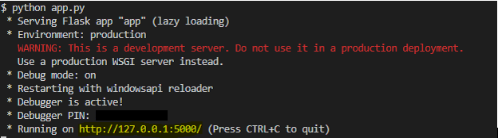

#  sqlalchemy-challenge

## Challenge Details

This challenge started with completing an analysis of Hawaii climate data from a sqlite file using Python and SQL Alchemy. Next, a Flask API was created to display the results of the climate analysis that was completed.

### Python and SQL Alchemy Analysis of Climate Data

#### Precipitation Analysis

The following actions were completed using the precipitation data:

* Retrieve the last 12 months of precipitation data
* Select only the date and prcp values
* Load the query results into a Pandas DataFrame and set the index to the date column
* Sort the DataFrame values by date.
* Plot the results using the DataFrame plot method
* Print the summary statistics for the precipitation data

#### Station Analysis

The following actions were completed using the station data:

* Calculate the total number of stations
* Find the most active stations
* List the stations and observation counts in descending order
* Find the station with the highest number of observations
* Retrieve the last 12 months of temperature observation data (TOBS)
* Filter by the station with the highest number of observations
* Plot the results as a histogram with bins=12

## Flask API

### About the Routes

The routes created by the Flask API include the following:

* / - home page, which tells the user what routes are available (see above image)
* /api/v1.0/precipitation - Converts the precipitation query results from above to a dictionary using date as the key and prcp as the value
    * JSON representation of the dictionary is returned
* /api/v1.0/stations - returns a JSON list of stations from the dataset
* /api/v1.0/tobs - Query the dates and temperature observations of the most active station for the last year of data and returns a JSON list of temperature observations (TOBS) for the previous year
* /api/v1.0/\<start> 
    * Calculate TMIN, TAVG, and TMAX for all dates greater than and equal to the start date
* /api/v1.0/\<start> and /api/v1.0/\<start>/\<end> 
    * Calculates the TMIN, TAVG, and TMAX for dates between the start and end date inclusive
  
Notes:
* For the precipitation dictionary that is returned, this was based on the query performed in the jupyter notebook task for the Precipitation Analysis. Therefore, all stations were used. Since this challenge asked us to specifically "Convert the query results to a dictionary using date as the key and prcp as the value" this means that only one value was given per date, even if multiple stations reported precipitation on a particular date. The dictionary key (in this case, date) must be unique, and therefore, each time a repeat date is added to the dictionary, it just overwrites the previous one.

* For the routes with user input dates, the data from all the stations for the requested date range was used, since no specific station was specified in the challenge details.

* To launch Flask API, the user must use command python app.py in a terminal window. Then, the user must click on the highlighted content seen in below image:

## Other Analyses

### Temperature Analysis I

A closer look was taken at whether a meaningful difference in temperature is seen in Hawaii over the course of the year, specifically, June and December. To do this, the average temperature in June and December for all stations across all available years was calculated. Next, a paired t-test was used to determine whether the difference in temperature mean between June and December was statistically significant. This test was used because the data is based on the same stations in the same locations, but at different times of the year. The data is based on the same groups and therefore a paired test should be used. The t-test indicated a value of 0.00012. This indicates that the difference in means between the temperature averages in June and the temperature averages in December is statistically significant.

### Temperature Analysis II

A function called calc_temps was included in the starter code for this challenge, which will accept a start date and end date in the format %Y-%m-%d. The function will return the minimum, average, and maximum temperatures for that range of dates.

Using the calc_temps function, the min, avg, and max temperatures were calculated for a date range of my choosing, to signify a vacation timeframe. Note: the data files provided only included data through 2017, so 2017 dates were chosen for this analysis.

Next, the min, avg, and max temperatures were plotted from your previous query as a bar chart, using the average temperature as the bar height and the peak-to-peak (TMAX-TMIN) value as the y error bar (YERR).

### Daily Rainfall Average Analysis

Finally, an analysis of rainfall was performed.

* The rainfall per weather station using the vacation timeframe dates was calculated
* The daily normals (averages for the min, avg, and max temperatures) were calculated
    * A function called daily_normals was included in the starter code given in this challenge, which will calculate the daily normals for a specific date
* The list of daily normals was loaded into a Pandas DataFrame and the index was set to the date
* Pandas was used to plot an area plot (stacked=False) for the daily normals

## Files Included

* Images folder - includes images pertaining to the Flask API 
* Resources folder - includes sqlite file
* climate_AP jupyter notebook file, which includes Precipitaion Analysis, Station Analysis, Temperature Analysis I and II, and Daily Rainfall Average Analysis
    * All visualizations can be seen in this file
* app.py which included all code to create and launch Flask API routes

