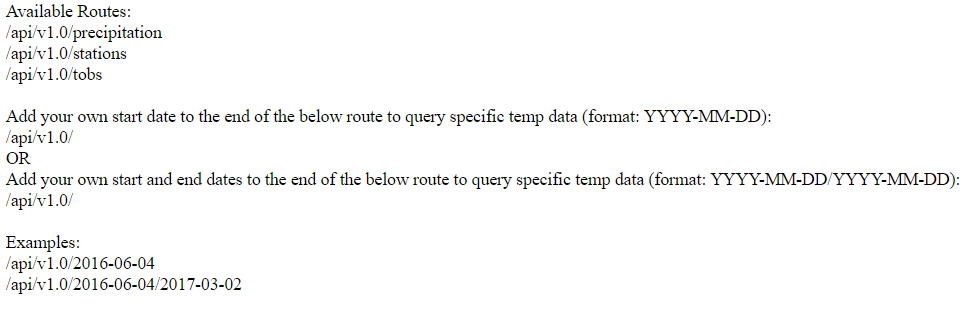

#  sqlalchemy-challenge

## Challenge Details

This challenge started with completing an analysis of climate data from a sqlite file using Python and SQL Alchemy. Next, a Flask API was created to display the results of the climate analysis that was completed.

### Python and SQL Alchemy Analysis of Climate Data

#### Precipitation Analysis

The following actions were completed using the precipitation data:

* Retrieve the last 12 months of precipitation data
* Select only the date and prcp values
* Load the query results into a Pandas DataFrame and set the index to the date column
* Sort the DataFrame values by date.
* Plot the results using the DataFrame plot method
* Print the summary statistics for the precipitation data

#### Station Analysis

The following actions were completed using the station data:

* Calculate the total number of stations
* Find the most active stations
* List the stations and observation counts in descending order
* Find the station with the highest number of observations
* Retrieve the last 12 months of temperature observation data (TOBS)
* Filter by the station with the highest number of observations
* Plot the results as a histogram with bins=12

## Flask API

### About the Routes

The routes created by the Flask API include the following:

* / - home page, which tells the user what routes are available (see above image)
* /api/v1.0/precipitation - Converts the precipitation query results from above to a dictionary using date as the key and prcp as the value
    * JSON representation of the dictionary is returned
* /api/v1.0/stations - returns a JSON list of stations from the dataset
* /api/v1.0/tobs - Query the dates and temperature observations of the most active station for the last year of data and returns a JSON list of temperature observations (TOBS) for the previous year
* /api/v1.0/\<start> 
    * Calculate TMIN, TAVG, and TMAX for all dates greater than and equal to the start date
* /api/v1.0/\<start> and /api/v1.0/\<start>/\<end> 
    * Calculates the TMIN, TAVG, and TMAX for dates between the start and end date inclusive
  
Notes:
* For the precipitation dictionary that is returned, this was based on the query performed in the jupyter notebook task for the Precipitation Analysis. Therefore, all stations were used. Since this challenge asked us to specifically "Convert the query results to a dictionary using date as the key and prcp as the value" this means that only one value was given per date, even if multiple stations reported precipitation on a particular date. The dictionary key (in this case, date) must be unique, and therefore, each time a repeat date is added to the dictionary, it just overwrites the previous one.

* For the routes with user input dates, the data from all the stations for the requested date range was used, since no specific station was specified in the challenge details.

* To launch Flask API, the user must use command python app.py in a terminal window. Then click on the highlighted content in below image:

## Some important notes:

1. For Temperature Analysis I, I decided to use a paired t-test. This is because the data is based on the same stations in the same locations, but at different times of the year. The data is based on the same groups and therefore a paired test should be used. My t-test indicated a value of 0.00012. This indicates that the difference in means between the temperature averages in June and the temperature averages in December is statistically significant.

2. I only used the Stations.csv for the analysis in Temperature Analysis II - in this section, I performed a join on the Measurement and Station data sets so I could return the station names, as well as their IDs. In all other sections, I only returned station IDs, since returning the station name did not seem to be needed.
